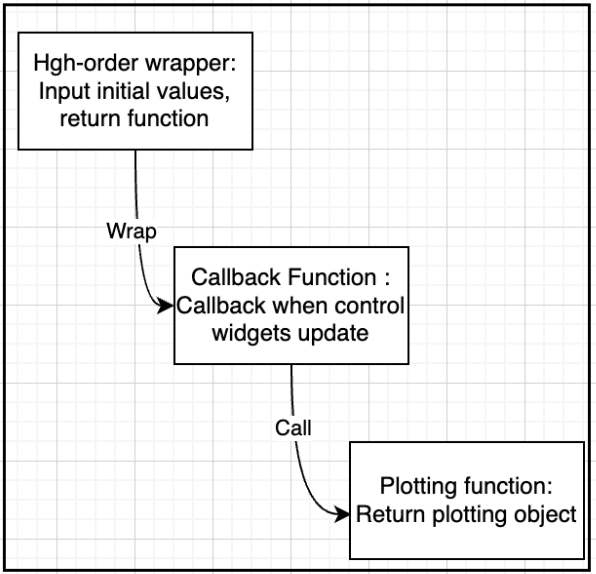

# Design Structure Overview
There are 3 levels in the structure. The Echoshader class acts as the controller that handles user interactions through widgets, triggers the necessary data updates, and updates the view accordingly. It achieves this through the use of callbacks and stream methods provided by libraries like Holoviews and Panel.

## **1st Level - High-order wrapper (`Echoshader` class)**

The **`Echoshader`** class serves as a comprehensive visualization toolset for analyzing acoustic data. It offers various visualization techniques such as echograms, tracks, curtains, histograms, and tables. Users can interactively explore the data by controlling parameters via interactive widgets.

### **Class Definition and Initialization**

- The **`Echoshader`** class is defined, inheriting from **`param.Parameterized`**, enabling easy integration of interactive parameters.
- The constructor (**`__init__`**) initializes the instance and sets up initial values for parameters.
- The **`_init_widget`** method creates interactive widgets that control visualization parameters.
- The **`_init_param`** method initializes additional parameters and streams required for visualization updates.

### **Visualization Methods**

- Methods are defined to generate different types of plots: echograms, tracks, curtains, histograms, and tables.
- These methods accept parameters that determine the plot's appearance and data selection.
- The **`param.depends`** decorator is used to specify dependencies on widget values and other parameters.
- These methods internally invoke helper functions that create the actual visualizations.

### **Callbacks and Streams**

- Callback methods are defined, such as **`_update_gram_box`**, triggered when gram box bounds change.
- Stream objects (e.g., **`holoviews.streams.BoundsXY`** and custom **`box_stream`**) connect user interactions to callbacks.
- Streams trigger callback methods when users interact with the visualization (e.g., selecting a box).

### **Data Retrieval**

- A method **`get_data_from_box`** retrieves data selected by a box in the visualization.

## **2nd Level - Callback Functions (Decorators and Stream Methods)**

- Decorators and stream methods are used to create callbacks that update plots when widget values or parameters change.
- For example, **`_update_gram_box`** is a callback method triggered when gram box bounds update.
- Stream objects facilitate user interactions by invoking corresponding callback methods.

## **3rd Level - Plotting Functions**

- Functions (**`_echogram_plot`**, **`_tricolor_echogram_plot`**, **`_track_plot`**, **`_tile_plot`**, **`_curtain_plot`**, **`_hist_plot`**, **`_table_plot`**) generate specific types of plots.
- These functions are called within **`Echoshader`** class methods to create actual visualizations.
- Libraries like Holoviews and Panel are used to generate and display plots.
- Customization options and parameters are available for the generated plots.